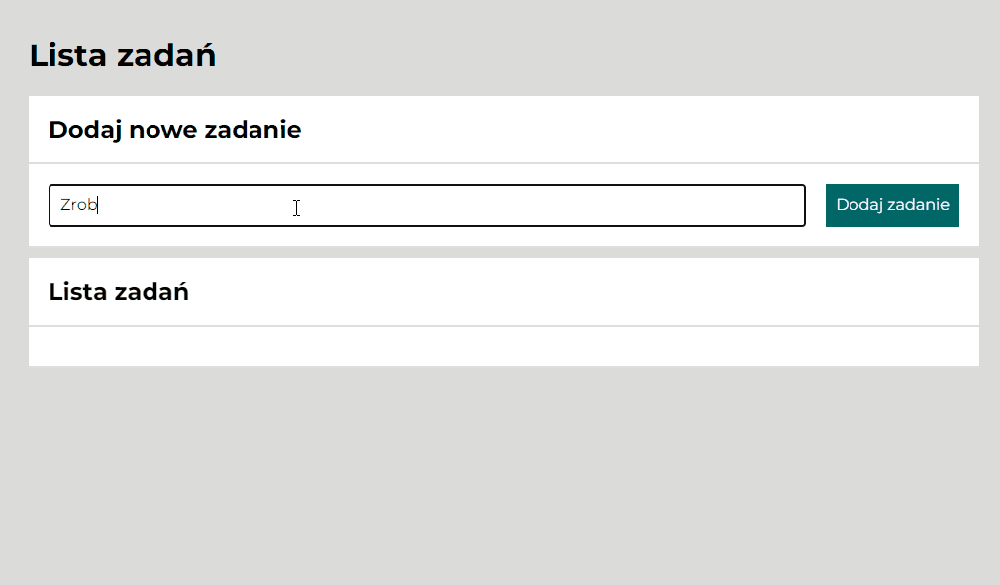

#  Task List 
## Demo
[Task list demo](https://maciejurny.github.io/to_do_list/)

## Description
Task list where you can write tasks to be done. Just write the task to be done, press the *"Dodaj zadanie"* button and your task will be displayed on the list. You can mark the task as done and / or remove it from the list.
## Technologies and conventions used in the project:
1. HTML
2. CSS
3. JavaScript
4. BEM
5. ES6+ Features
6. Grid
7. Flex
8. Immutability